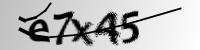

# Text from Images

This project aims to recognize the text from captcha images using a combination of Convolutional Neural Networks (CNN) and Recurrent Neural Networks (RNN) trained with Connectionist Temporal Classification (CTC) loss.

### Overview
Captcha images are commonly used in the web to ensure that the user is a human and not a bot. These images contain text of varied length which can be challenging to read even for humans. This project uses a deep learning approach to read and recognize this text.

The model architecture is a combination of CNN and RNN. The CNN part of the model is used to extract features from the captcha images. These features are then passed to the RNN part of the model which is used to recognize the sequence of characters in the text.

The model is trained with CTC loss. CTC is a popular loss function for sequence prediction problems where the length of the output sequence can be different from the length of the input sequence. It's particularly suitable for this project because the length of the text in the captcha images can vary.

### Model

The model is a combination of Convolutional Neural Networks (CNN) and Recurrent Neural Networks (RNN), designed to extract features from the captcha images and recognize the sequence of characters in the text.

The model first sends the input image through two blocks. Each block consists of a two successive passes over convolutional layer follwed by a batch normalization layer and relu activation. After each block the image is sent through the max pooling layer.  
The convolutional layer applies a set of learnable filters to the input image, the batch normalization layer normalizes the output of the convolutional layer, and the max pooling layer reduces the spatial dimensions of the output.
```python
x = F.relu(self.bn1(self.conv1(x)))
x = F.relu(self.bn2(self.conv2(x)))
x = self.pool1(x)

x = F.relu(self.bn1(self.conv3(x)))
x = F.relu(self.bn2(self.conv4(x)))
x = self.pool2(x)
```

After passing through these blocks, the model has a set of feature maps that represent the features of the input image.

Next, the width of the image is transposed to make it as sequence length in the model. This is done because the RNN expects the input to be in the form of (batch_size, seq_len, input_size), so the width of the image is treated as the sequence length. The `input_size` of the image is projected to a hidden dimension, to reduce the feature vector from `C*H` to `hidden_dim`.

The output of the CNN is sent to a 2-layer bidrectional-GRU to learn the features over the sequence length. Finally, the model applies a linear layer to transform the output to the desired number of classes, and a softmax function to get the probabilities for each class.

The final output of the model is a tensor of size (seq_len, num_class), where seq_len is the sequence length (width of the image) and num_class is the number of classes. Each element in the tensor represents the probability of a particular class at a particular time step.

### Loss Function

Connectionist Temporal Classification (CTC) loss is being used to train the model. The CTC loss is a popular choice for sequence prediction tasks where the length of the output sequence can be different from the length of the input sequence. Here in our case the width of the image is the length of the input, which can be anywhere from 50-100, based on the input image width. But the output sequence (which is the captcha text) generally ranges from 5-10 characters. So CTC loss helps in matching these unequal seqeuences.

```python
loss = criterion(output, targets, input_lengths, target_lengths)
```

`output`: This is the output from the model, expected to be of size (T, N, C), where T is the maximum length of the output sequence (seq_len), N is the batch size, and C is the number of classes (including the blank label).

`targets`: This is the ground truth labels, expected to be of size (N, S), where S is the maximum length of the target sequence.

`input_lengths`: This is a 1D tensor of size (N,) that contains the actual lengths of the output sequences for each item in the batch. In the code, it's created with torch.full and each value is set to output.shape[0], which is the sequence length (seq_len).

`target_lengths`: This is a 1D tensor of size (N,) that contains the actual lengths of the target sequences for each item in the batch.

### Examples

 - **24pew**

 - **e7x45**